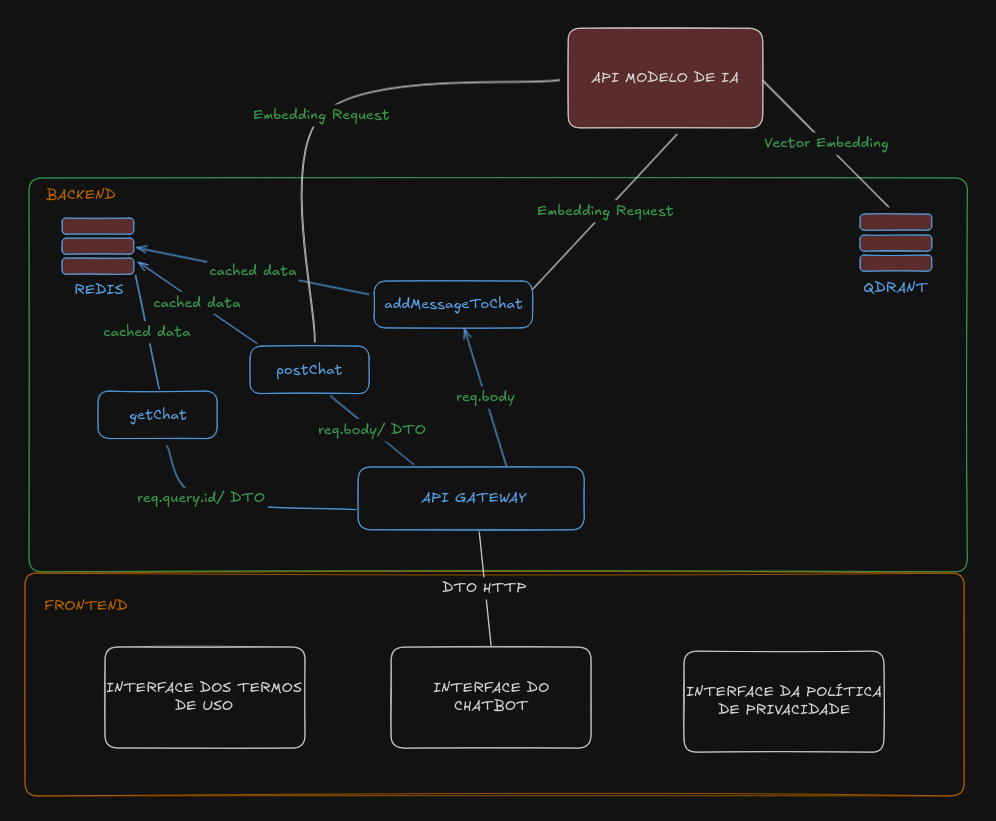

# Frontend Local Build
```
cd frontend
nvm use # or 'nvm install 20' followed by 'nvm use 20' if you dont have node 20 installed
npm install
npm run dev
```

# Backend Local Build
```
cd chat-api
nvm use # or 'nvm install 20' followed by 'nvm use 20' if you dont have node 20 installed
npm install
npm run dev
```

# Backend Mock Local Build
```
cd mock-chat-api
nvm use # or 'nvm install 20' followed by 'nvm use 20' if you dont have node 20 installed
npm install
npm run dev
```

# Run Redis Locally on Ubuntu
```
sudo apt update
sudo apt install redis-server
sudo service redis-server start
redis-cli ping # must return PONG
```

# Arch

Three interfaces were implemented. The first is the home page, which contains general information about the developed tool and the chatbot itself.
In the interactive chat, users can export the chat as a JSON file to save all the messages exchanged between the user and the application. Additionally, the conversation can also be imported into the chat to facilitate understanding for future user needs.
This import/export feature was implemented as a workaround to reduce the complexity required for developing a full message history feature, which would demand a more advanced database architecture, backend authentication services, and additional UI components.

The second and third interfaces correspond to the Privacy Policy and Terms of Use pages. These are currently drafts of what the final versions should look like in a production environment.

On the backend, there are four main entities that make up the chat service API:

- API Gateway: The node that receives client requests and routes them to the appropriate services. It runs on Express and Node.js, and is written in TypeScript;

- postChat Service: Available at the "/post-chat" endpoint, this service is responsible for creating a new conversation in the Redis database when the user sends the first message in a session;

- getChat Service: Available at the "/get-chat" endpoint, this service retrieves a conversation JSON from Redis based on the chat ID key. It is called every time a new user message is sent or when a previously exported conversation is imported;

- addMessageToChat Service: Available at the "/add-msg-to-chat" endpoint, this service adds a new message to an existing chat in Redis. It can be used both from the client (browser/user) to the application and from the application to the client.

In addition, the GPT-3.5 API was used as the core of the RAG (Retrieval-Augmented Generation) system for natural language processing. The processing flow follows these steps:

- Embedding Generation: 
    - When the user sends a message, either the postChat or addMessageToChat service sends the text to an embedding model;

    - This model converts the message into a numeric vector (embedding) that semantically represents the content.

- Vector Search in Qdrant: 
    - The generated embedding is used as a query in the Qdrant vector database, which contains undergraduate documents from UNIFESP and related metadata;

    - Qdrant returns the most relevant excerpts based on vector similarity.

- Contextualized Response: These retrieved results are sent to GPT-3.5, which generates a response grounded in the official documents.

- Storage: The generated response is then stored in Redis as a message with the direction "RECEIVED", in order to display the response to the client.